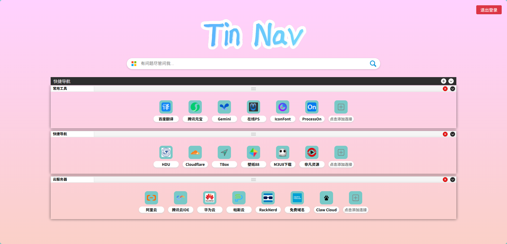

# TinNav

浏览器导航页，使用 cloudflare workers、assets、kv存储，依赖于 [Cloudflare WxApi](https://github.com/Tinger-X/cloudflare-wx-api) 实现登录。

# 运行效果

[https://nav.tinger.host](https://nav.tinger.host):

# 部署

1. fork或clone本项目到本地
2. 将 [wrangler-expamle.jsonc](wrangler-expamle.jsonc) 重命名为 `wrangler.jsonc`
3. 修改 `wrangler.jsonc` 中的 `routes.pattern`, `kv_namespaces.id`, `vars.*`
4. 安装依赖：`npm i`
5. 部署：`npm run deploy`

# 注意

本项目默认使用 [https://wx-api.tinger.host/oauth](https://wx-api.tinger.host/oauth) 作为登录服务器，如需修改为自己的服务器，可参考 [Cloudflare WxApi](https://github.com/Tinger-X/cloudflare-wx-api) 开通微信服务号、搭建自己的登录服务器。之后再修改本项目中 [/public/init.html](/public/init.html) 和 [/public/static/manager.js](/public/static/manager.js) 中带有 `https://wx-api*`的部分为自己的后端服务地址